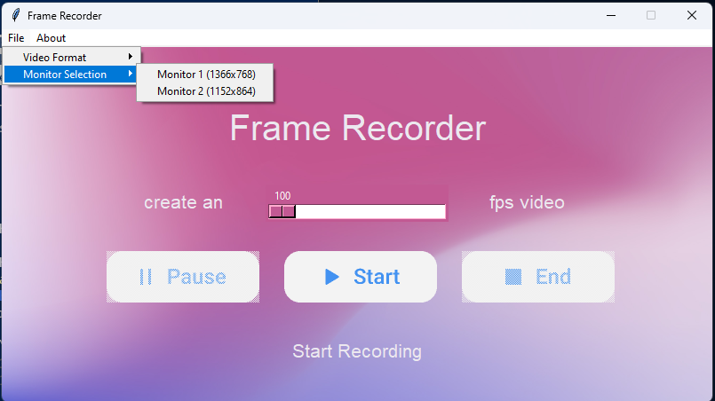

<div align="center">

[Türkçe Docs](https://github.com/mehmet-mert/FrameRecorder/blob/master/Docs/README_tr.md)

[](https://git.io/typing-svg)

</div>

FrameRecorder is a tool that records your screen while you are working.

Imagine you are drawing pictures or writing a program on your computer. Wouldn't you like to shoot small clips of your work while doing this? That's when Frame Recorder comes to your aid. See hours of process in just a few minutes!

## Updates in v1.1 by [Asib Hossen](https://github.com/asibhossen897)

### Added a new feature to record the screen by selecting a specific monitor.



Goto File -> Monitor Selection and select the monitor you want to record.

### FrameRecorder [YouTube Introduction](https://www.youtube.com/watch?v=lYoVWss5-F0&t=1s)


## Getting Started

Clone the repository to your computer.

```bash
git clone https://github.com/asibhossen897/FrameRecorder.git
```


### Prerequisites

<b>Python 3</b> and <b>pip</b> must be installed in your computer.

Run the following command to install the required packages.

```bash
pip install -r requirements.txt
```

If you want to run this in a Linux based OS, you need to install **python3-tk** and **scrot** package.

```bash
sudo apt-get install python3-tk scrot
```

### Running the program
From the terminal, navigate to the directory where you cloned the repository. Then run the following command.

```bash
python main.py
```

## License

This project is licensed under the MIT License - see the [LICENSE](https://github.com/mehmet-mert/FrameRecorder/blob/master/LICENSE) file for details

## Acknowledgments

* Thanks to [ Mehmet Mert Altuntaş ](https://github.com/mehmet-mert) for creating FrameRecorder. 

* GUI Created (Modified) by @ParthJadhav by using [Tkinter-Designer](https://github.com/ParthJadhav/Tkinter-Designer)

* Thanks to [Umut Sancı](https://github.com/Umut-Umut) and [Süleyman Hilmi Akkaya](https://github.com/hilmiAkkaya) for testing.

* Thanks to [İsmet Fatih Güçlü](https://github.com/fatih51) for release v1.0 .

